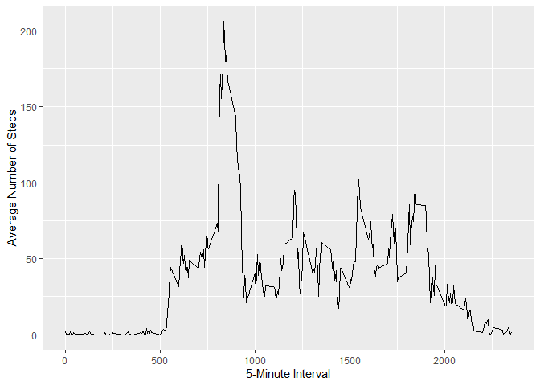

# Course Project 1   
## Loading and preprocessing the data
##### 1. Load the data using read.csv()


```r
unzip(zipfile = "activity.zip")
activity <- read.csv("activity.csv")
```

## What is mean total number of steps taken per day?
##### 1. Calculate the total number of steps taken per day


```r
totsteps <- tapply(activity$steps, activity$date, FUN = sum, na.rm = TRUE)
```

##### 2. If you do not understand the difference between a histogram and a barplot, research the difference between them. Make a histogram of the total number of steps taken each day


```r
library(ggplot2)
qplot(totsteps, binwidth = 500, xlab = "Total Steps Taken Each Day")
```

<!-- -->

##### 3. Calculate and report the mean and median of the total number of steps taken per day


```r
totmean <- mean(totsteps, na.rm = TRUE)
totmedian <- median(totsteps, na.rm = TRUE)
```
* Mean: 9354.2295082 
* Median: 10395

## What is the average daily activity pattern?
##### 1. Make a time series plot of the 5-minute interval (x-axis) and the average number of steps taken, averaged across all days (y-axis)


```r
average <- aggregate(x = list(steps = activity$steps), by = list(interval = activity$interval), FUN = mean, na.rm = TRUE)
ggplot(data = average, aes(x = interval, y = steps), ) +
    geom_line() +
    xlab("5-Minute Interval") +
    ylab("Average Number of Steps")
```

<!-- -->

##### 2. Which 5-minute interval, on average across all the days in the dataset, contains the maximum number of steps?


```r
maxSteps <- which.max(average$steps)
maxStepsTime <-  gsub("([0-9]{1,2})([0-9]{2})", "\\1:\\2", average[maxSteps,'interval'])
```
* Most steps taken at 8:35

## Imputing missing values
##### 1. Calculate and report the total number of missing values in the dataset


```r
missing <- length(which(is.na(activity$steps)))
```
* 2304 values are missing

##### 2. Create a new dataset that is equal to the original dataset but with the missing data filled in

```r
library(Hmisc)
imputedActivity <- activity
imputedActivity$steps <- impute(activity$steps, fun = mean)
```

##### 3. Make a histogram of the total number of steps taken each day and Calculate and report the mean and median total number of steps taken per day. Do these values differ from the estimates from the first part of the assignment? What is the impact of imputing missing data on the estimates of the total daily number of steps?


```r
imputedTotsteps <- tapply(imputedActivity$steps, imputedActivity$date, sum)
qplot(imputedTotsteps, binwidth = 500, xlab = "Total Steps Taken Each Day (Imputed)")
```

<!-- -->

```r
imputedTotmean <- mean(imputedTotsteps)
imputedTotmedian <- median(imputedTotsteps)
imputedTotmean_round <- round(imputedTotmean, 2)
imputedTotmedian_round <- round(imputedTotmedian, 2)
```
* Imputed Mean: 1.076619\times 10^{4}
* Imputed Median:  1.076619\times 10^{4}

## Are there differences in activity patterns between weekdays and weekends?
##### 1. Create a new factor variable in the dataset with two levels – “weekday” and “weekend” indicating whether a given date is a weekday or weekend day.


```r
imputedActivity$dayType <-  ifelse(as.POSIXlt(imputedActivity$date)$wday %in% c(0,6), 'weekend', 'weekday')
```

##### 2. Make a panel plot containing a time series plot of the 5-minute interval (x-axis) and the average number of steps taken, averaged across all weekday days or weekend days (y-axis). See the README file in the GitHub repository to see an example of what this plot should look like using simulated data.


```r
imputedAverage <- aggregate(steps ~ interval + dayType, data = imputedActivity, mean)
ggplot(imputedAverage, aes(interval, steps)) + 
    geom_line() + 
    facet_grid(dayType ~ .) +
    xlab("5-minute Interval") + 
    ylab("Average Number of Steps")
```

<!-- -->
